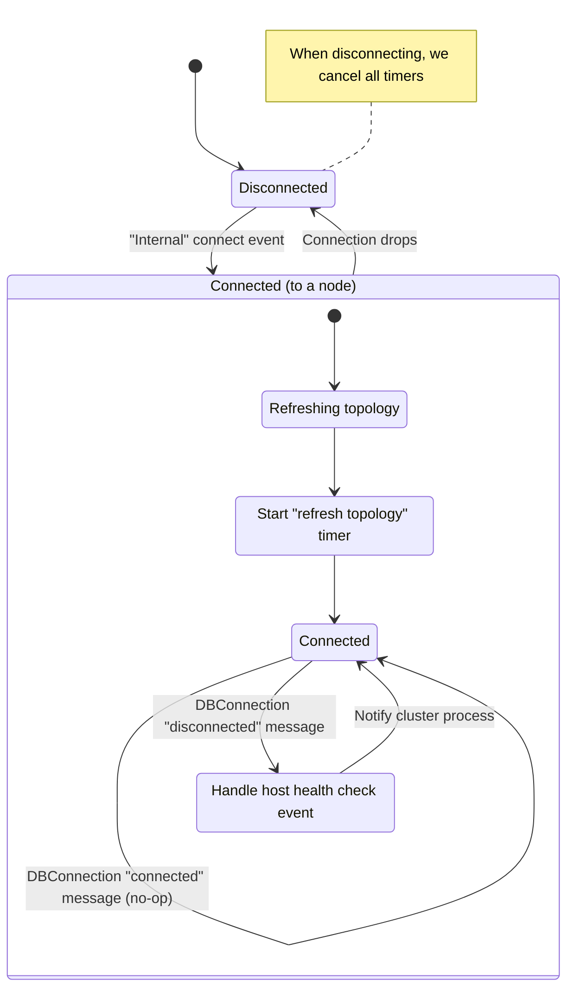

# Architecture

## Cluster

### Control Connection

```mermaid
stateDiagram-v2
    disconnected : Disconnected
    connected_to_node : Connected (to a node)

    [*] --> disconnected

    disconnected --> connected_to_node: "Internal" connect event

    state connected_to_node {
        refreshing : Refreshing topology
        set_refresh_topology_timer : Start "refresh topology" timer
        connected: Connected
        host_health_check : Handle host health check event

        [*] --> refreshing
        refreshing --> set_refresh_topology_timer
        set_refresh_topology_timer --> connected

        connected --> connected : DBConnection "connected" message (no-op)

        connected --> host_health_check : DBConnection "disconnected" message

        host_health_check --> connected : Notify cluster process
    }


    connected_to_node --> disconnected: Connection drops
    note left of disconnected: When disconnecting, we cancel all timers
```
